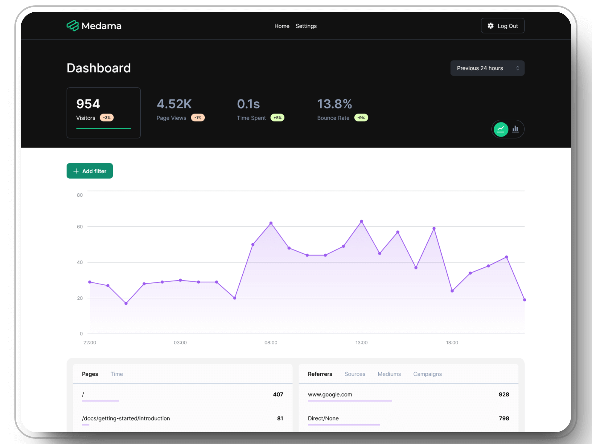

  <picture>
    <source media="(prefers-color-scheme: dark)" srcset="./.github/images/banner-dark.svg">
    <source media="(prefers-color-scheme: light)" srcset="./.github/images/banner-light.svg">
    
  </picture>
   
  <a href="https://oss.medama.io/introduction">Website</a> |
  <a href="https://oss.medama.io/deployment/installation">Installation</a> |
  <a href="https://demo.medama.io">Demo</a> |
  <a href="https://medama.io/discord">Discord</a>

## Overview

Medama Analytics is an open-source project dedicated to providing self-hostable, cookie-free website analytics. With a lightweight tracker of less than 1KB, it aims to offer useful analytics while prioritising user privacy.

    

### Features

- 📊 **Real-Time Analytics:** Monitor website performance and user interactions instantly.

- 🔒 **Privacy-Focused:** Lightweight tracker (<1KB) without cookies, IP addresses, or additional identifiers, ensuring compliance with GDPR, PECR, and other regulations.

- 🧪 **Easy To Integrate:** [OpenAPI-based](https://oss.medama.io/api-reference/introduction) server for effortless integration into personal or professional dashboards.

- 💼 **Self-Hostable:** Simple, single-binary setup with no external dependencies, capable of running on VMs with 256MB memory for most small websites.

## License

The `/core` and `/dashboard` directory is licensed under the Apache License 2.0. See the core [LICENSE](./core/LICENSE) and dashboard [LICENSE](./dashboard/LICENSE) for more information.

The `/tracker` directory is licensed under the MIT License. See [LICENSE](./tracker/LICENSE) for more information.
